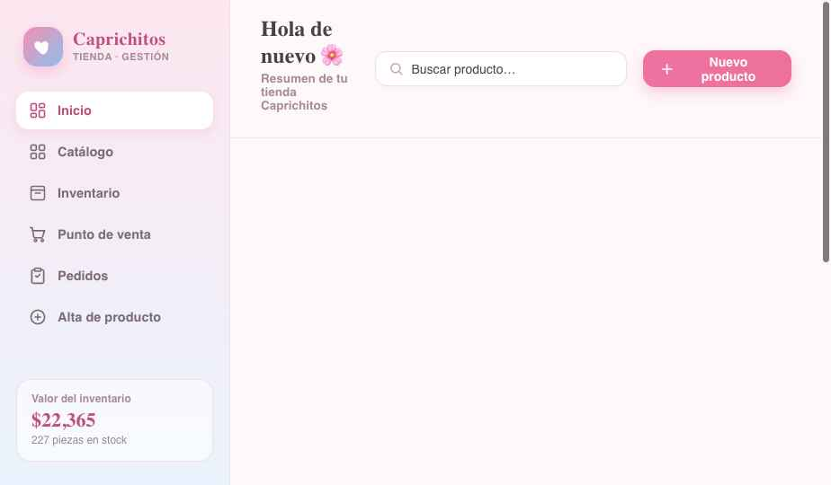

<div align="center">

# 🌸 Caprichitos

### Tienda en línea + gestión de inventario, todo en uno

*Catálogo público para tus clientes · Panel privado para ti · SKU y códigos QR · Punto de venta con escáner · Control de maquinitas*

<br/>


<br/>



</div>

---

## ✨ ¿Qué hace?

**Caprichitos** es una app web con dos caras:

🛍️ **Catálogo público** — la tienda que ven tus clientes desde cualquier celular. Se actualiza sola conforme subes productos, con buscador, filtros por categoría y tus datos de contacto y ubicación.

🔐 **Panel de administración** — tu centro de control privado (en una ruta secreta), para manejar todo el negocio.

| Sección | Qué hace |
|---|---|
| 🏠 **Inicio** | Ventas del día, valor del inventario y alertas de stock bajo de un vistazo. |
| 🧾 **Alta de producto** | Crea un producto, **súbele foto o tómala con la cámara**, y genera su **SKU** y **código QR** automáticos, listos para imprimir. |
| 🗂️ **Catálogo** | Edita, muestra/oculta, reimprime QR y elimina productos. |
| 📦 **Inventario** | Ajusta stock al instante y recibe alertas cuando algo se está agotando. |
| 💳 **Punto de venta** | **Escanea el QR con la cámara**, arma el carrito, muestra el total y registra la venta (descuenta stock solo). |
| 🚚 **Pedidos** | Pedidos a proveedor; al marcarlos *recibido* se suma el stock automáticamente. |
| 🕹️ **Máquinas** | Da de alta maquinitas (individual, doble, triple o de peluche) por **ubicación**, registra **recolecciones** (monto + fecha) y consulta historial y totales. |

---

## 🚀 Empezar en 1 minuto

```bash
npm install      # solo la primera vez
npm run dev      # http://localhost:5173
```

- 🛍️ **Catálogo (clientes):** `http://localhost:5173/`
- 🔐 **Panel (tú):** `http://localhost:5173/cap-panel-2741` *(ruta secreta, configurable en `src/config.ts`)*

> 💡 Sin configurar nada, la app arranca en **modo prueba** con datos locales en tu navegador
> (contraseña `caprichitos`). Conéctala a la nube cuando quieras usarla de verdad 👇

---

## ☁️ Conectar a la nube (Supabase)

Para que los datos se guarden de verdad y tus clientes vean el catálogo desde su celular:

1. Crea un proyecto gratis en **[supabase.com](https://supabase.com)**.
2. Copia tus llaves de **Project Settings → API** al archivo `.env`:
   ```env
   VITE_SUPABASE_URL=https://xxxxx.supabase.co
   VITE_SUPABASE_ANON_KEY=sb_publishable_....
   ```
3. Arma las tablas **desde la terminal** (sin tocar el dashboard). Copia la cadena del
   **Session pooler** (Connect → Session pooler) a `.env` como `SUPABASE_DB_URL` y ejecuta:
   ```bash
   npm run db:setup
   ```
   Crea tablas, seguridad (RLS) y el almacenamiento de fotos. Es **idempotente** (puedes
   correrlo las veces que quieras).
4. Crea tu usuario admin:
   ```bash
   node scripts/create-admin.mjs "tu@correo.com" "tu_contraseña"
   ```
5. Reinicia `npm run dev`. La app detecta las llaves y pasa a **modo nube** automáticamente. 🎉

---

## 🔐 Seguridad

- 🙈 El `.env` **nunca** se sube al repo (está en `.gitignore`).
- 🌐 Solo las variables `VITE_*` llegan al navegador. `SUPABASE_DB_URL` (con tu contraseña) se queda en tu computadora.
- 🛡️ Reglas **RLS** en Supabase: el público solo **lee** productos activos; todo lo demás requiere tu sesión de admin.
- 🚪 El panel vive en una **ruta secreta** que no está enlazada en ningún lado.

---

## 🛠️ Stack

| Capa | Tecnología |
|---|---|
| Interfaz | React + Vite + TypeScript |
| Datos, login y fotos | Supabase (Postgres + Auth + Storage) |
| Códigos | `qrcode` (genera) · `html5-qrcode` (escanea) |
| Hosting sugerido | Vercel / Netlify |

---

## 📦 Scripts

| Comando | Para qué |
|---|---|
| `npm run dev` | Levanta la app en desarrollo |
| `npm run build` | Compila la versión de producción |
| `npm run preview` | Prueba la build de producción |
| `npm run db:setup` | Crea/actualiza las tablas en Supabase |
| `node scripts/create-admin.mjs` | Crea un usuario administrador |

---

## 🌍 Publicar en internet

1. Sube el repo a GitHub.
2. Importa el proyecto en **[Vercel](https://vercel.com)** y agrega las variables `VITE_SUPABASE_URL` y `VITE_SUPABASE_ANON_KEY`.
3. ¡Listo! Comparte tu URL (ej. `caprichitos.vercel.app`) con tus clientes.

> El ruteo SPA ya está configurado (`vercel.json` y `public/_redirects`).

---

<div align="center">

Hecho con 💖 para **Caprichitos** · *Regalos y novedades* 🌸

</div>
